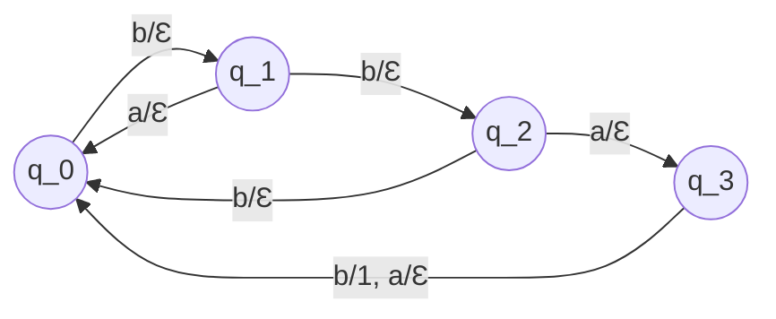

# Hausaufgaben
## 4a)

```mermaid
flowchart LR
	q_0((q_0)) --b/Ɛ--> q_1
	q_1((q_1)) --a/Ɛ--> q_0
	q_1 --b/Ɛ--> q_2
	q_2((q_2)) --b/Ɛ--> q_0
	q_2 --a/Ɛ--> q_3
	q_3((q_3)) --b/1, a/Ɛ--> q_0
	
 
```
## 4b
